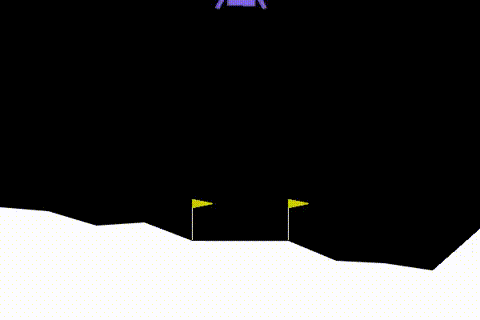

# PPO LunarLander — From Scratch

A from-scratch PyTorch implementation of Proximal Policy Optimization (PPO) for continuous control, trained and evaluated on `LunarLanderContinuous-v3` (Gymnasium). No Stable-Baselines3, the actor-critic network, GAE, and the clipped PPO update are all implemented directly.



## Results

Trained for 25M timesteps on CPU (8 parallel environments), the final policy achieves:

| Metric | Value |
|---|---|
| Mean return (250 episodes) | **205.07 ± 60.83** |
| Min / Max return | 24.92 / 305.07 |

`LunarLanderContinuous-v3` is considered solved at a mean return ≥ 200 over 100 consecutive episodes. This policy clears that bar.

## Features

- PPO implemented from scratch: clipped surrogate objective, GAE(λ) advantage estimation, value function clipping, entropy bonus, gradient clipping
- Diagonal Gaussian policy for continuous action spaces, with orthogonal weight initialization
- Vectorized rollout collection (`SyncVectorEnv`, 8 parallel environments) for CPU-efficient training
- Observation and reward normalization with running statistics, persisted after training so evaluation reproduces the exact input distribution the policy was trained on
- Linear annealing of both learning rate and entropy coefficient over training
- CLI overrides for quick experimentation without editing the config file

## Project structure
 
```
.
├── src/
│   ├── config.py           # all hyperparameters, as asingle dataclass
│   ├── buffer.py           # rollout storage + GAE advantage computation
│   ├── ppo_agent.py        # actor-critic network + PPO update rule
│   ├── train.py            # training loop orchestrator
│   ├── evaluate.py         # policy evaluation (deterministic, raw returns)
│   └── results/            # generated at runtime (checkpoints, logs, videos) — gitignored
├── requirements.txt
├── .gitignore
└── assets/
    └── demo.gif
```

## Setup

Requires Python 3.11 (Box2D wheels are most reliably precompiled for this version).

```bash
conda create -n ppo-continuous python=3.11 -y
conda activate ppo-continuous
python -m pip install -r requirements.txt
```

## Usage

### Train

```bash
python train.py --total-timesteps 25000000
```

Useful overrides for quick experiments:
```bash
python train.py --total-timesteps 20000 --num-steps 512 --device cpu
```

Checkpoints and observation normalization stats are saved to `results/checkpoints/` every `checkpoint_interval` updates, plus a final `ppo_final.pt` / `obs_rms.npz` pair at the end of training.

### Evaluate

```bash
python evaluate.py --episodes 250
```

Add `--render` to record videos of evaluation episodes (requires `moviepy`):
```bash
python evaluate.py --episodes 8 --render
```

Use `--stochastic` to sample actions instead of using the policy's deterministic mean.

## Algorithm notes

- **Policy**: diagonal Gaussian with a state-independent, learnable log standard deviation — the actor network outputs only the mean.
- **Advantage estimation**: GAE(λ) with bootstrapping from the critic's value estimate at the rollout boundary, since the rollout horizon rarely aligns with episode termination.
- **Value loss**: clipped in the same way as the policy objective, following the original PPO paper, to prevent large value function updates from destabilizing training.
- **Entropy annealing**: the entropy bonus coefficient decays linearly from `0.01` to `0.0` over training — high early for exploration, low late for policy refinement. This was one of two fixes that meaningfully improved results (see below).

## Debugging notes

A few non-obvious issues came up during development, worth documenting for anyone hitting the same symptoms:

- **Policy stuck in a poor local optimum**: with a fixed, non-annealed entropy coefficient, the policy's action distribution collapsed to near-determinism early in training and stopped improving (vanishing policy gradient signal, `approx_kl` near zero for many updates). Annealing the entropy coefficient from a higher initial value down to zero resolved this.
- **Evaluation returns far worse than training returns**: the policy is trained on observations normalized with running statistics accumulated over millions of steps. Re-wrapping the environment with a *fresh* normalizer at evaluation time (as is easy to do by accident) feeds the policy an unfamiliar input distribution and tanks performance — even for a policy that is actually training well. Fix: persist the running statistics (`obs_rms.npz`) after training and load them before evaluation.
- **Value loss silently miscomputed**: in the clipped value loss, `torch.max` must compare the *squared* clipped and unclipped errors, accidentally comparing the squared error against the raw (non-squared) clipped value estimate still runs without error, but corrupts the critic's training signal.

## License

MIT